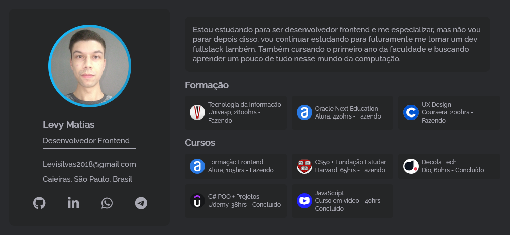

# Portfólio 💻👨

Projeto desenvolvido no programa oracle one como desafio da formação frontend.

## ⚙️ Funcionalidades

- Apliquei metodologia BEM nas classes css e atomic design que foi nos passado durante a formação frontend.

## 🚀 Deploy

- <a href="https://levymatias.github.io/Portfolio/" target="_blank">Live</a>

## 🛠️ Tecnologias utilizadas

**Front-end:** 

 - Javascript, 
 - HTML, 
 - CSS

**Ferramentas:** 

- Visual Studio Code,
- Git

## 🦸 Autores

- <a href="https://www.linkedin.com/in/levy-matias/" target="_blank">Levy Matias</a>
  
---
